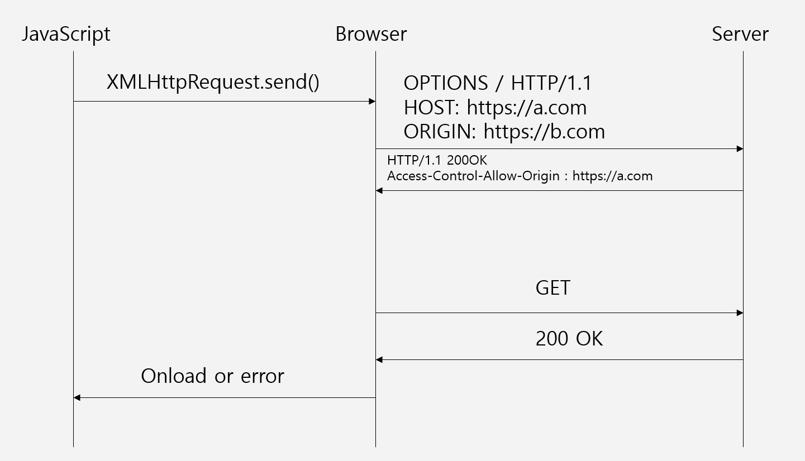

# CORS

## CORS란?

교차 출처 리소스 공유(Cross-Origin Resource Sharing,CORS)는 추가 HTTP헤더를 사용하여 한 출처에서 실행 중인 웹 애플리케이션이 다른 출처의 선택한 자원에 접근할 수 있는 권한을 부여하도록 브라우저에 알려주는 체제입니다.

예를들어 `https://a.com`에서의 프론트엔드 javascript코드가 XMLHttpRequest를 사용하여 `https://b.com/data.json`을 요청하는 경우

## 다른출처란?

다른출처를 알기 위해서는 URL의 구조를 봐야됩니다.

**URL구조는 아래와 같습니다**<br>

**https://bottleon.github.io:433/web/cors?page=1#CORS란?**

```
https:// = protocol or scheme
bottleon.github.io = host or domain
:433 = port
/web/cors = path
?page=1 = Query문자열
#CORS란? = Fragment
```

여기서 protocol, host, port중 하나라도 다르면 다른출처가 됩니다.

## 출처(Origin)란?

위의 URL구조에서 protocol, host, port를 합친 것입니다. 개발자 도구에서 `location.origin`을 실행하면 출처를 확인할 수 있습니다.

## CORS 사용이유

보안상의 이유로 브라우저는 스크립트에서 시작한 교차 출처 HTTP 요청을 제한합니다.

http 혹은 https는 **SOP(same-orgin policy:동일 출처 정책)**를 따르기 때문입니다. <br>

<details>
<summary>SOP?</summary>
SOP는 한 Origin(출처)에서 로드된 문서 또는 스크립트가 다른 Origin(출처)의 리소스와 상호작용할 수 있는 방법을 제한하는 중요한 보안 메커니즘입니다.
<br>
즉, 웹은 오픈되어 있어서 공격들어 올 수 있기 때문에 SOP를 사용합니다.
</details>

즉, 같은 출처(protocol,host,port가 같은 것)끼리만 자원공유가 가능하게 브라우저가 제한을 건 것입니다.<br>
이 제한을 풀기 위해서 CORS를 사용해야 됩니다.

## CORS시나리오

요청해더에는 Orgin이라는 헤더가 있고 응답헤더에는
Access-Control-Allow-Origin이라는 헤더가 있습니다.<br>

CORS는 클라이언트가 요청헤더에 출처(Origin)를 담아서 보내면 서버에서 응답헤더로 허용된 출처(Access-Control-Allow-Origin)에 요청한 출처의 값을 넣거나 보내지 않아서 해당 출처의 허용의 유무를 결정해서 응답해줍니다.<br>

즉 요청헤더의 Origin과 응답헤더의 Access-Control-Allow-Origin이 같으면 같은출처라고 브라우저는 인식합니다.

CORS시나리오는 크게 3가지 입니다.

1. **Preflight Request**
2. **Simple Request**
3. **Credentialed Request**

### Preflight Request(사전요청)



1. JavaScript에서 XMLHttpRequest라는 메서드로 요청을 보냅니다.
2. 브라우저는 서버에게 두개의 다른 요청 헤더와 출처(Origin)를 `OPTIONS`라는 메서드를 통해 사전요청(preflight request)으로 보냅니다
   - OPTIONS는 서버에서 추가 정보를 판별하는데 사용하는 HTTP/1.1메서드입니다.

```
Access-Control-Request-Method : POST(요청방식)
Access-Control-Request-Headers: Content-Type(사용자 정의 헤더)
```

3. 서버는 Access-Control-Allow-Method로 응답하고 `POST`와 `GET`이 리소스를 가져오는데 유용한 메서드라고 알려줍니다. 또한 Access-Control-Allow-Headers의 값을 `Content-Type`으로 전송하여 실제 요청에 헤더를 사용할 수 있음을 확입합니다.<br>
   Access-Control-Allow-Origin을 통해 출처를 보내 줍니다.

4. 브라우저에서 Origin과 Access-Control-Allow-Origin의 출처를 비교하여 같으면 같은출처로 인식하고 다르면 다른출처로 CORS에러를 보냅니다. 다른 출처인데 서버는 200인 경우는 사전요청에서 CORS에러는 해당 브라우저가 판단하기 때문에 서버에서는 200의 성공 코드를 반환합니다.<br>
   `브라우저에서 CORS에러가 났으면 서버에게 부탁해서 Access-Control-Allow-Origin의 값에 자신의 Origin을 포함시켜줘야 됩니다.`

### Simple Request


Simple Request는 예비요청이 없고 `본요청`에서 예비요청이 했던 것을 본요청에서 합니다.<br>
이것 말고는 다른 것은 비슷합니다.<br>
브라우저가 Origin과 Access-Control-Origin을 비교해서 CORS정책을 위반했는지 확인합니다.<br>
Simple Request는 조건이 있습니다.

```
1.GET,HEAD,POST메세지로 보내야 됩니다.
2.Accept,Accept-Language,Content-Language,Content-Type,DPR,Downlink,Save-Data,Viewport-Width,Width를 제외한 헤더는 사용하면 안됩니다..
3.POST일 경우 application/x-www-form-urlencoded, multipart/form-data, text/plain중 하나여야합니다.
```

위의 조건을 어길 경우 `Preflight Request`로 보냅니다.<br>
2번조건은 조금 더 복잡하고 상용화된 웹 애플리케이션에서는 인증 동작을 위한 `Authorization`헤더만 하더라도 조건을 지킬 수 없습니다.<br>
그리고 3번의 조건에서 restAPI를 사용하면 `application/json`이 대부분 필요한데 이럴 경우에는 사용하기 힘들 것 같습니다.

### Credentialed Request

인증된 요청을 사용하여 보안을 조금 더 강화시킵니다.<br>
요청에서 인증과 관련된 정보를 담을 수 있게 해주는 옵션이 `credentials`옵션입니다.<br>

비동기API들은 기본적으로 쿠키를 담아서 요청을 보내지 않습니다.<br>

credentials에는 3가지 옵션이 있습니다

```
same-origin(기본값) : 같은 출처 간 요청에만 인증정보를 담습니다.
Include : 모든 요청에 인증정보를 담습니다.
Omit : 모든 요청에 인증 정보를 담지 않습니다.
```

다른 출처에서의 요청에 쿠키와 같은 인증정보를 포함하고 싶으면 `credentials:'include'`옵션을 추가하면 됩니다.


브라우저에서 쿠키키를 요청헤더에 포함시켜 서버에 보냅니다. -> 서버에서 쿠키키를 확인하여 쿠키를 포함한 응답을 해줍니다.

```
Access-Control-Allow-Origin에는 *를 사용할 수 없으며, 명시적인 URL이여야 합니다.
응답헤더에는 Access-Control-Allow-Credentials:true가 존재해야 됩니다.
```

참고

- <https://developer.mozilla.org/ko/docs/Web/HTTP/CORS>
- <https://velog.io/@pilyeooong/CORS%EB%9E%80-%EB%AC%B4%EC%97%87%EC%9D%B8%EA%B0%80>
- <https://kamang-it.tistory.com/entry/Web%EB%8F%99%EC%9D%BC-%EC%B6%9C%EC%B2%98-%EC%A0%95%EC%B1%85-CORS-%EB%8F%84%EB%8C%80%EC%B2%B4-%EB%AD%98%EA%B9%8C>
