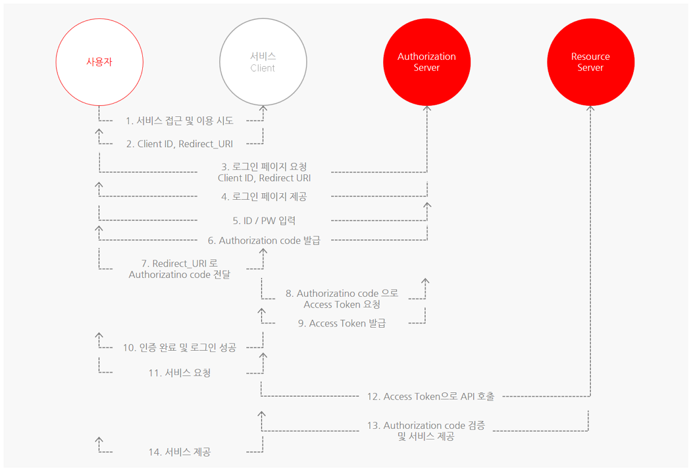

# OAuth2.0란?


서비스를 제공해주는 곳에서 회원가입하는게 아닌 간편로그인으로 구글이나 카카오 혹은 네이버같은 Resource Server에서의 계정이 있다면 해당 Resource Server에서 로그인, 개인정보등을 관리하게 하고 접근 권한을 부여하는 프로토콜입니다.

## OAuth의 4가지 참여자

- Resource Owner
  - 서비스을 이용자입니다.
- Resource Server
  - 자원을 관리하고 access토큰을 이용하여 자원요청에 대해 응답해줍니다
- Client
  - 서비스 이용자를 대신하여 Resource Server에 자원을 요청해줍니다.
- Authorization Server
  - 이용자의 인증을 받아서 access토큰과 refresh토큰을 제공해줍니다.(refresh토큰은 무조건 제공X)

## OAuth의 동작

<https://developers.payco.com/guide/development/start>에서 페이코의 OAuth동작 프로세스 확인이 가능합니다.<br>



1. 사용자가 서비스에 접근합니다.
2. 서비스는 OAuth를 사용한 곳에서의 받은 Client ID와 설정한 Redirect_URL의 값을 줍니다
   
   
3. 사용자는 위의 2값들을 권한서버에 주면서 로그인페이지를 요청합니다.

   ```
   https://resource.server/? # 리소스 서버(네이버, 카카오 사이트 url)
   client_id=1 # 어떤 서비스인지 알려줌
   &scope=A,B #사용자가 사용할려는 기능
   &redirect_uri=http://localhost:5500 # 개발자 홈페이지에 서비스 개발자가 입력한 응답 콜백.
   ```

4. 권한서버는 해당 값이 API 형식에 맞게 올바른 값이 들어간지 확인하고 로그인페이지를 제공해줍니다.
5. 사용자는 ID/PW를 입력합니다.
   - 이 때 client가 사용하려는 scope(기능)에 대해서 사용자의 동의를 요청합니다.
6. 권한서버는 확인한 후에 권한 코드를 사용자에게 발급해줍니다.
7. 사용자는 받은 권한코드를 Redirect_URL에 넣어서 서비스에게 줍니다.
   ```
    http://localhost:5500?code=3
   ```
8. 서비스는 권한서버에게 권한코드를 주면서 Access Token을 요청합니다.
9. 권한서버는 확인 후 Access Token을 서비스에게 발급해줍니다.
10. 서비스는 토큰을 받고 사용자에게 인증이나 로그인이 성공되었다고 알려줍니다.
11. 사용자는 서비스를 요청합니다.
12. 서비스는 토큰을 가지고 자원서버에 API를 호출합니다.
13. 자원서버는 권한코드를 검증하고 서비스를 제공해줍니다.
14. 서비스는 자원서버에서 받은 서비스를 사용자에게 제공해줍니다.

## 토큰을 사용하는 이유

예시로 서비스제공해주는 곳에서 사용자의 구글ID와 비밀번호를 받아서 권한서버와 요청,응답을 하였을 때 무슨 짓을 할지 모르기때문에 이런 것을 방지하기 위해서 권한서버에서 사용자에게 권한코드를 주고 사용자는 권한코드를 서비스한테 주고 서비스는 다시 권한서버에 줘서 확인이 되면 토큰을 발급하여 서비스는 모르게 사용자를 식별할 수 있게 합니다.

## refresh Token과 함께 Access Token을 전달하는 경우

이럴 때는 사용자가 매번 권한코드를 받아서 서비스한테 주고 서비스는 그걸로 권한서버에 Access Token을 받고 하는 게 많을 때나 번거러워서 초기에 Access Token을 줄 때 Refresh Token을 같이 줘서 토큰기간을 Refresh Token을 조금 더 길게하여서 Refresh Token의 기간동안 Access Token을 재발급할 때 번거러운 과정을 생략하고 바로 토큰을 제공해주기 위해서 입니다.

## OAuth 1.0과 2.0의 차이

<u>2.0은 1.0의 보안문제를 개선한 버전입니다.</u>

|             |             OAuth1.0             | OAuth2.0                                          |
| :---------- | :------------------------------: | ------------------------------------------------- |
| 참여자 구분 | 이용자<br>소비자<br>서비스제공자 | 자원 소유자<br>클라이언트<br>권한서버<br>자원서버 |
| 토큰        |       요청토큰<br>접근토큰       | 접근토큰<br>재발급토큰                            |
| 유효기간    |      접근 토큰의 유효기간 X      | 접근 토큰 유효기간 부여<br>만료시 재발급토큰 이용 |
| 클라이언트  |            웹 서비스             | 웹,앱                                             |

# 참조

<https://itwiki.kr/w/OAuth>
<https://datatracker.ietf.org/doc/html/rfc6749>
